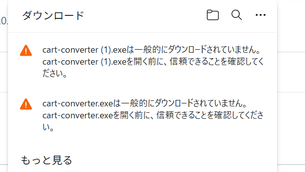

# カート投入変換ツール

やさいバスの商品リスト（Excel）から、店舗ごとのカート投入用Excelファイルを自動生成するデスクトップアプリです。

## デモ

## ダウンロード

**[最新版ダウンロード](../../releases/latest)** ページから `cart-converter.exe` をクリックしてダウンロードしてください。

ダブルクリックで起動できます（インストール不要）。

> **ダウンロード時の警告について**
>
> 以下のような警告が表示されることがありますが、アプリ自体に問題はありません（コード署名がないために表示されます）。
>
> 
>
> - **ブラウザの警告**：「一般的にダウンロードされていません」→ `…`（メニュー）→「保存」または「保持する」を選択
> - **Windows Defenderの警告**：「詳細情報」→「実行」をクリック

## 使い方

1. **商品リスト** — 「選択」ボタンから `【集計】2w商品リスト～.xlsx` を選択
2. **出力先フォルダ** — 初回はデスクトップがデフォルト（変更すると次回以降記憶されます）
3. **変換実行** — クリックすると出力先に日付フォルダが作られ、店舗ごとの `カート投入用_○○.xlsx` が出力されます

## 不具合の報告・改善の要望

何か問題が起きたり、「こうなったらいいな」という改善点があれば、お気軽にお知らせください。
「こんなアプリがあったら便利！」という新しいアイデアも大歓迎です。

投稿いただいた内容は **1週間程度** で確認・対応します。

> **⚠ 注意：** このページは誰でも閲覧できます。パスワード・顧客情報などの **秘匿情報は絶対に書き込まないでください。**

### 報告の手順

1. このページ上部の **[Issues](../../issues)** タブをクリック
2. 右上の緑色の **「New issue」** ボタンをクリック
3. **Title（タイトル）** に内容を一言で書く（例：「変換ボタンを押してもエラーになる」）
4. **本文** に詳しく書く
   - 何をしたか（例：商品リストを選択して変換実行を押した）
   - 何が起きたか（例：エラーメッセージが出た）
   - こうなってほしい、という希望があれば
   - エラー画面のスクリーンショットがあると助かります
5. **「Submit new issue」** ボタンを押して送信

難しく考えず、困ったことをそのまま書いてもらえればOKです！
